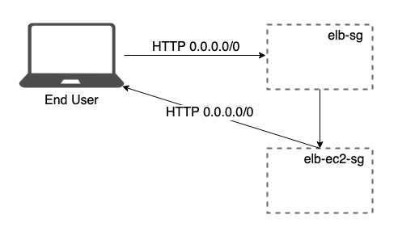

# Tutorial: Implement Elastic Load Balancer in AWS

This tutorial will teach you how to implement an Application Load Balancer using AWS ELB to route traffic among instances in different avaliability zones.

## Architecture


## Workflow

The end user makes a request to your application, which is served by a NodeJS web server hosted in an EC2 instance.

There're two instances configured the same way in two different availability zones behind the Load Balancer (ELB). Both the EC2 and the ELB are secured by a Security Group (SG).

The ELB security group is configured to receive traffic from the internet (inbound traffic) and to send requests to the EC2 (outbound traffic). The EC2 security group is configured to receive traffic from the ELB SG (inbound) and to send responses to the internet (outbound).

The Node.js app is running at port 3000 and Nginx is configured as reverse proxy to route requests from port 80 (HTTP) to port 3000 and vice versa.

## Prerequisites

This tutorial asumes you have an AWS account and you've configured AWS credentials for CLI, if you haven't [please do so](https://docs.aws.amazon.com/cli/latest/userguide/cli-chap-install.html#post-install-configure).

I have configured the CLI to use the `us-east-1` region, so all the resources will be created in this region.

To follow the procedures in this tutorial you'll need a command line terminal to run commands. Commands are shown as below:

```
(bash) $ command
----------------
output
```

`(bash) $ ` is a constant indicating that is a command running in bash. Everything below `--------------` is the output of the command, or if the response is a JSON, it will have its own section denoted by **Output:** header.

Also I'm using `jq`, a command line tool used to extract information from `JSON` data, example: the following command returns a JSON with the information of the `VPC`s:

```shell
(bash) $ aws ec2 describe-vpcs
```

Output:

```json
{
  "Vpcs": [
    {
      "VpcId": "vpc-d64fd4ac",
      "InstanceTenancy": "default",
      "CidrBlockAssociationSet": [
        {
          "AssociationId": "vpc-cidr-assoc-38a5d154",
          "CidrBlock": "172.31.0.0/16",
          "CidrBlockState": {
            "State": "associated"
          }
        }
      ],
      "State": "available",
      "DhcpOptionsId": "dopt-0c363277",
      "OwnerId": "436887685341",
      "CidrBlock": "172.31.0.0/16",
      "IsDefault": true
    }
  ]
}
```

But, as I'm only interested in the `VpcId` field of my default `VPC`, I can use `jq` to extract only that field:

```shell
(bash) $ aws ec2 describe-vpcs | jq '.Vpcs | .[0] | .VpcId'
--------------
"vpc-d64fd4ac"
```

Explanation:

`aws ec2 describe-vpcs` return a `JSON` object. I use the pipe operator `|` to send the JSON to the `jq` command. `jq` takes an string as input describing how you want to filter the data delimited either by `'` or `"`. Here I'll be using `'`. The input string of `jq` has its own syntax, which you can consult in the [official documentation](https://stedolan.github.io/jq/manual). First I extract the `Vpcs` field from the `JSON` data, `Vpcs` is an array. As you can see `jq` also make use of the pipe operator `|`, once I extracted `Vpcs` field it results in an array, I use `|` to take that array as input and extract the first element `.[0]`, that results in an object with the information of the `VPC`, and again I use the pipe operator to extract the `VpcId` field.

I'm using `jq` only to make te output shorter for the sake of the length of the tutorial text.

Feel free to not use `jq` and only copy the `aws` commands and look for the information by your own.

To install in Mac simple run the command `brew install jq`.

## Security Groups

First we'll create the security groups for the EC2 instances and for the Load Balancer.

To create a security group we use the following API:

```
aws ec2 create-security-group --description <value> --group-name <value> [--vpc-id <value>]
```

For that reasson we require to have the **VPC Id** in which the SGs will be breated on.

To get the **VPC Id** we use the following command:

```shell
(bash) $ aws ec2 describe-vpcs | jq '.Vpcs | .[0] | .VpcId'
--------------
"vpc-d64fd4ac"
```

Now I can create the security groups:

```bash
(bash) $ aws ec2 create-security-group --group-name elb-sg --vpc-id vpc-d64fd4ac --description "SG that would be assigned to the ELB. Inbound from public, outbound to EC2 SG."
```

Output:

```json
{
  "GroupId": "sg-0795506e7d719a67a"
}
```

```bash
(bash) $ aws ec2 create-security-group --group-name elb-ec2-sg --vpc-id vpc-d64fd4ac --description "SG that would be assigned to the EC2 instances. Inbound from EC2 SG, outbound to public."
```

Output:

```json
{
  "GroupId": "sg-0c1018438bf942a83"
}
```

By default, all security groups has an outbound rule assigned that enables any protocol to any IP, and we can verify that:

```bash
(bash) $ aws ec2 describe-security-groups --group-id sg-0795506e7d719a67a | jq '.SecurityGroups | .[0] | .IpPermissionsEgress'
```

Output:

```json
[
  {
    "IpProtocol": "-1",
    "PrefixListIds": [],
    "IpRanges": [
      {
        "CidrIp": "0.0.0.0/0"
      }
    ],
    "UserIdGroupPairs": [],
    "Ipv6Ranges": []
  }
]
```

`ip-Protocol: "-1"` refers to any protocol. `ipRanges.[0].CidrIp: "0.0.0.0/0` refers to anywhere. In summary any protocol to anywhere.

For security reasons we're going to remove that rule and assign our own.

### Revoke default outbound rules

```bash
(bash) $  $ aws ec2 revoke-security-group-egress --group-id sg-0795506e7d719a67a --ip-permissions '[{ "IpProtocol": "-1", "IpRanges": [{ "CidrIp": "0.0.0.0/0" }] }]'
```

Note that the rule you're revoking must match exaclty.

Now, you can verify that tue rule was removed successfuly by running again the describe command:

```bash
(bash) $ aws ec2 describe-security-groups --group-id sg-0795506e7d719a67a | jq '.SecurityGroups | .[0] | .IpPermissionsEgress'
--------------
[]
```

Run again the same command to revoke outboud permissions but now with the other security group:

```bash
(bash) $  $ aws ec2 revoke-security-group-egress --group-id sg-0c1018438bf942a83 --ip-permissions '[{ "IpProtocol": "-1", "IpRanges": [{ "CidrIp": "0.0.0.0/0" }] }]'
```

And verify it was executed successfuly:

```bash
(bash) $ aws ec2 describe-security-groups --group-id sg-0c1018438bf942a83 | jq '.SecurityGroups | .[0] | .IpPermissionsEgress'
--------------
[]
```

### Add inbound and outboud rules



Remember, ELB must accept HTTP requests from anywhere and must be able to reach EC2, and EC2 must be able to accept HTTP requests from ELB and send HTTP responses to anywhere.

```bash
(bash) $ aws ec2 authorize-security-group-ingress --group-id sg-0795506e7d719a67a --protocol tcp --port 80 --cidr 0.0.0.0/0
```

To verify:

```bash
(bash) $ aws ec2 describe-security-groups --group-id sg-0795506e7d719a67a | jq '.SecurityGroups | .[0] | .IpPermissions'
```

Output:

```json
[
  {
    "PrefixListIds": [],
    "FromPort": 80,
    "IpRanges": [
      {
        "CidrIp": "0.0.0.0/0"
      }
    ],
    "ToPort": 80,
    "IpProtocol": "tcp",
    "UserIdGroupPairs": [],
    "Ipv6Ranges": []
  }
]
```

Now, let's add outbound rules.

```bash
(bash) $ aws ec2 authorize-security-group-egress --group-id sg-0795506e7d719a67a --protocol tcp --port 80 --source-group sg-0c1018438bf942a
```

To verify:

```bash
(bash) $ aws ec2 describe-security-groups --group-id sg-0795506e7d719a67a | jq '.SecurityGroups | .[0] | .IpPermissionsEgress'
```

Output:

```json
[
  {
    "PrefixListIds": [],
    "FromPort": 80,
    "IpRanges": [],
    "ToPort": 80,
    "IpProtocol": "tcp",
    "UserIdGroupPairs": [
      {
        "UserId": "436887685341",
        "GroupId": "sg-0c1018438bf942a83"
      }
    ],
    "Ipv6Ranges": []
  }
]
```

Now let's do the same with the EC2 SG.

```bash
(bash) $ aws ec2 authorize-security-group-ingress --group-id sg-0c1018438bf942a83 --protocol tcp --port 80 --source-group sg-0795506e7d719a67a
```

```bash
(bash) $ aws ec2 authorize-security-group-egress --group-id sg-0c1018438bf942a83 --protocol tcp --port 80 --cidr 0.0.0.0/0
```

Our security groups are now configured as described in the architecture. Let's continue with the EC2 configuration.

## EC2 Instances

To create an instance we use the following API:

```
run-instances
    [--image-id <value>]
    [--instance-type <value>]
    [--security-group-ids <value>]
    [--subnet-id <value>]
    [--user-data <value>]
```

We'll create the instances in different availability zones, for that reasson we require to have the `subnet-id`s of two different AZs (remember that there's a subnet for each AZ).

```bash
(bash) $ aws ec2 describe-subnets | jq '.Subnets | .[] | select(.AvailabilityZone == "us-east-1a" or .AvailabilityZone == "us-east-1b") | .SubnetId'
--------------
"subnet-4bc9862c"
"subnet-0d024951"
```

We'll use `Amazon Linux 2` as image of type `t2.micro`.

To run the instances now we can run the following commands:

```bash
(bash) $ aws ec2 run-instances --image-id "ami-0b898040803850657" --instance-type "t2.micro" --security-group-ids "sg-0c1018438bf942a83" --subnet-id "subnet-4bc9862c" --user-data file://build/user_data.sh
```

```bash
(bash) $ aws ec2 run-instances --image-id "ami-0b898040803850657" --instance-type "t2.micro" --security-group-ids "sg-0c1018438bf942a83" --subnet-id "subnet-0d024951" --user-data file://build/user_data.sh
```

The output of the previous commands is a large `JSON` with the information of the created instances.

## Elastic Load Balancer

In this section we are going to perform the following actions:

* Create an Application Load Balancer
* Create a Target Group
* Register EC2 instances in the Target Group
* Attach the Target Group to the ALB

To finish the implementation we're going to create the load balancer that will balance the traffic between instances placed in different availability zones.

In this section we'll be using the new version of the ELB API (`elbv2`). For more information about load balancers and the previous version (Classic Load Balancer) refer to the [AWS ELB website](https://aws.amazon.com/elasticloadbalancing/).

### Create Application Load Balancer

```bash
(bash) $ aws elbv2 create-load-balancer --name az-balancer --subnets "subnet-4bc9862c" "subnet-0d024951" --security-groups sg-0795506e7d719a67a --type application
```

In this command we specify the subnet IDs on which the EC2 where created. Also notice that I'm specifying to use an `application` load balancer as `type`. It's not required to specify the type for an ALB due to this is the default value.

The outpot of the previous command is the information of the newly created ELB in `provisioning` state.

```json
{
  "LoadBalancers": [
    {
      "IpAddressType": "ipv4",
      "VpcId": "vpc-d64fd4ac",
      "LoadBalancerArn": "arn:aws:elasticloadbalancing:us-east-1:436887685341:loadbalancer/app/az-balancer/16e1035ea7353934",
      "State": {
        "Code": "provisioning"
      },
      "DNSName": "az-balancer-984482325.us-east-1.elb.amazonaws.com",
      "SecurityGroups": [
        "sg-0795506e7d719a67a"
      ],
      "LoadBalancerName": "az-balancer",
      "CreatedTime": "2019-08-30T21:43:22.310Z",
      "Scheme": "internet-facing",
      "Type": "application",
      "CanonicalHostedZoneId": "Z35SXDOTRQ7X7K",
      "AvailabilityZones": [
        {
          "SubnetId": "subnet-0d024951",
          "ZoneName": "us-east-1a"
        },
        {
          "SubnetId": "subnet-4bc9862c",
          "ZoneName": "us-east-1b"
        }
      ]
    }
  ]
}
```

### Create Target Group

```
create-target-group
    --name <value>
    [--protocol <value>]
    [--port <value>]
    [--vpc-id <value>]
    [--health-check-protocol <value>]
    [--health-check-port <value>]
    [--health-check-enabled | --no-health-check-enabled]
    [--health-check-path <value>]
    [--health-check-interval-seconds <value>]
    [--health-check-timeout-seconds <value>]
    [--healthy-threshold-count <value>]
    [--unhealthy-threshold-count <value>]
    [--matcher <value>]
    [--target-type <value>]
    [--cli-input-json <value>]
    [--generate-cli-skeleton <value>]
```

```bash
(bash) $ aws elbv2 create-target-group --name instances --target-type instance --vpc-id vpc-d64fd4ac --protocol HTTP --port 80 --health-check-path /health
```

Output:

```json
{
  "TargetGroups": [
    {
      "HealthCheckPath": "/health",
      "HealthCheckIntervalSeconds": 30,
      "VpcId": "vpc-d64fd4ac",
      "Protocol": "HTTP",
      "HealthCheckTimeoutSeconds": 5,
      "TargetType": "instance",
      "HealthCheckProtocol": "HTTP",
      "Matcher": {
        "HttpCode": "200"
      },
      "UnhealthyThresholdCount": 2,
      "HealthyThresholdCount": 5,
      "TargetGroupArn": "arn:aws:elasticloadbalancing:us-east-1:436887685341:targetgroup/instances/a0a5d74cc162d760",
      "HealthCheckEnabled": true,
      "HealthCheckPort": "traffic-port",
      "Port": 80,
      "TargetGroupName": "instances"
    }
  ]
}
```

### Register instances in the Target Group

```
register-targets
  --target-group-arn <value>
  --targets <value>
```

```bash
(bash) $ aws elbv2 register-targets --target-group-arn arn:aws:elasticloadbalancing:us-east-1:436887685341:targetgroup/instances/a0a5d74cc162d760 --targets Id=i-068ae792dddda59aa Id=i-0af96e0f5e3c427c8
```

### Create Listener for the ELB

```
create-listener
  --load-balancer-arn <value>
  --protocol <value>
  --port <value>
  [--ssl-policy <value>]
  [--certificates <value>]
  --default-actions <value>
  [--cli-input-json <value>]
  [--generate-cli-skeleton <value>]
```

```bash
(bash) $ aws elbv2 create-listener --load-balancer-arn arn:aws:elasticloadbalancing:us-east-1:436887685341:loadbalancer/app/az-balancer/16e1035ea7353934 --protocol HTTP --port 80 --default-actions Type=forward,TargetGroupArn=arn:aws:elasticloadbalancing:us-east-1:436887685341:targetgroup/instances/a0a5d74cc162d760
```

Putput:

```json
{
  "Listeners": [
    {
      "Protocol": "HTTP",
      "DefaultActions": [
        {
          "TargetGroupArn": "arn:aws:elasticloadbalancing:us-east-1:436887685341:targetgroup/instances/a0a5d74cc162d760",
          "Type": "forward"
        }
      ],
      "LoadBalancerArn": "arn:aws:elasticloadbalancing:us-east-1:436887685341:loadbalancer/app/az-balancer/16e1035ea7353934",
      "Port": 80,
      "ListenerArn": "arn:aws:elasticloadbalancing:us-east-1:436887685341:listener/app/az-balancer/16e1035ea7353934/c175a94b94efc72e"
    }
  ]
}
```
